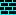

# 🚗 Battle City Clone

A modern, retro-inspired browser remake of the classic NES game **Battle City**. Defend your base, destroy enemy tanks, and relive the arcade action—all in your browser!

---

## 🎮 Features
- 20x20 tile map with destructible and indestructible walls
- Player and enemy bases with health
- Smooth, grid-based tank movement
- Player and enemy shooting (with bullet collision)
- Multiple enemy tanks (20 per level, 5 on screen at once)
- Retro UI with timer and score
- Custom sprites and classic feel

---

## 🕹️ How to Play
- **Move:** Arrow keys
- **Shoot:** Spacebar
- **Defend your base** (green) and destroy the enemy base (red)!
- Survive waves of enemy tanks—if your base or tank is destroyed, it's game over.

---

## 🚀 Getting Started
1. Clone the repo:
   ```bash
   git clone https://github.com/RobZombie3434/tank-city-battle-mania.git
   cd tank-city-battle-mania
   ```
2. Open `index.html` in your browser.

---

## 🖼️ Sprites Used
All sprites are in the `sprites/` folder:

| Player Tank | Enemy Tank | Player Base | Enemy Base |
|:-----------:|:----------:|:-----------:|:----------:|
|  |  |  |  |

| Brick Wall | Steel Wall |
|:----------:|:----------:|
|  |  |

---

## 👾 Credits
- Sprites inspired by the original NES Battle City
- Created by Robin Domingo

---

## 📜 License
This project is for educational and fun purposes. Not for commercial use. 